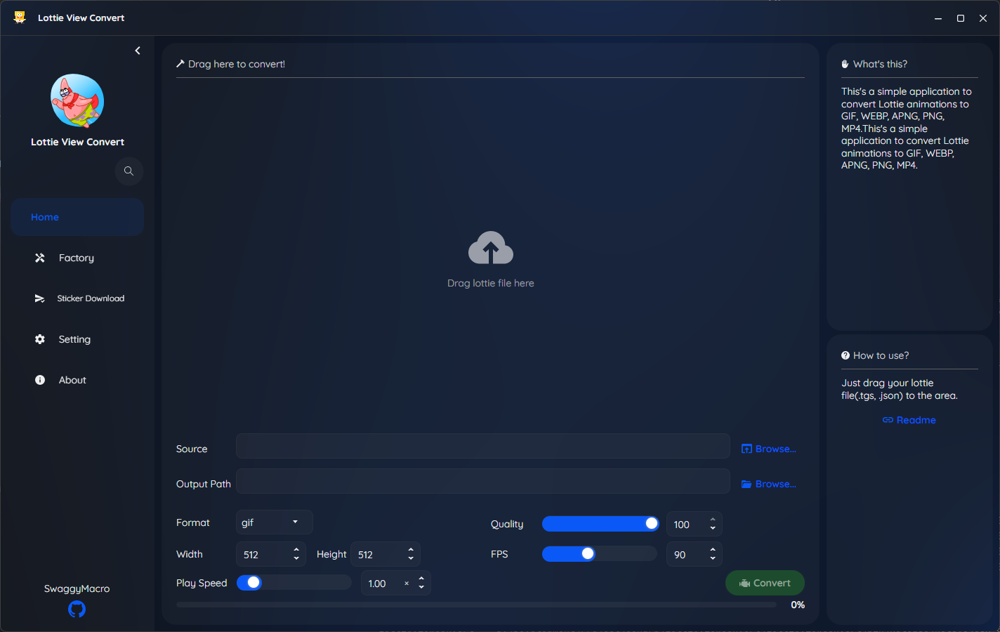

<p align="center">
    
</p>
<p align="center">
    <a href="readme_cn.md"></a>
    
    <a href="//github.com/SwaggyMacro/LottieViewConvert"></a>
</p>

## 🎬 Lottie & TGS Animation Converter

A powerful cross-platform desktop application for converting TGS (Telegram Stickers) and Lottie animations to various formats including GIF, WebP, APNG, MP4, MKV, AVIF, and WebM.

### ✨ Features
---
- **Multiple Format Support**: Convert to GIF, WebP, APNG, MP4, MKV, AVIF, WebM
- **TGS & Lottie Support**: Handle both Telegram stickers (.tgs) and standard Lottie files (.json, .lottie)
- **Customizable Output**: Adjust playback speed, frame rate, resolution, and conversion quality
- **Cross-Platform**: Works on Windows, macOS, and Linux
- **Modern UI**: Built with SukiUI for a sleek, responsive interface
---

### 📝 TODO List
- **Batch Processing**: Convert multiple files simultaneously *(Coming Soon)*
- **Telegram Integration**: Parse and download Telegram sticker sets directly *(Coming Soon)*
- **Automatic Installation of Dependencies**: Simplify setup by automating gifski and FFmpeg installation *(Coming Soon)*

### 📝 System Requirements
---
Install the following dependencies and ensure they are available in your PATH:

#### Required Dependencies
- **[gifski](https://gif.ski)** - For high-quality GIF conversion
- **[FFmpeg](https://ffmpeg.org)** - For video format conversion (MP4, MKV, WebM)

#### Installation Instructions

**Windows:**
```bash
# Install via Chocolatey
choco install gifski ffmpeg

# Or download directly:
# gifski: https://gif.ski/
# ffmpeg: https://ffmpeg.org/download.html
```

**macOS:**
```bash
# Install via Homebrew
brew install gifski ffmpeg
```

**Linux (Ubuntu/Debian):**
```bash
# gifski
sudo snap install gifski
# or
cargo install gifski

# ffmpeg
sudo apt update
sudo apt install ffmpeg
```

**Verify Installation:**
```bash
gifski --version
ffmpeg -version
```

### 🚀 Getting Started
---

#### 1. Download and Install
- Download the latest release from the [Releases](https://github.com/SwaggyMacro/LottieViewConvert/releases) page
- Extract the archive to your preferred location
- Run the application executable

#### 2. Basic Usage
1. **Launch the application**
2. **Select source files**: Click "Add Files" or drag & drop TGS/Lottie files
3. **Choose output format**: Select from GIF, WebP, APNG, MP4, MKV, AVIF, WebM
4. **Adjust settings** (optional):
    - Frame rate (1-240 fps, 100 fps for GIF only)
    - Resolution (maintain aspect ratio)
    - Playback speed (0.1x - 10.0x)
    - Quality settings
5. **Convert**: Click "Convert"
6. **Output**: Converted files will be saved to your specified output directory

#### 3. Advanced Features
- **Quality Presets**: Choose from Low, Medium, High, or Custom quality settings
- **Batch Operations**: Queue multiple conversions with different settings
- **Preview**: Real-time preview of animations before conversion
- **Progress Tracking**: Monitor conversion progress for each file

### 🖼️ Screenshots
---


https://github.com/user-attachments/assets/244dc639-832e-4b98-a6de-5b85f283549d

### 📋 Supported Formats
---

#### Input Formats
- `.tgs` - Telegram Sticker files
- `.json` - Lottie animation files

#### Output Formats
- `.gif` - Animated GIF
- `.webp` - Animated WebP
- `.apng` - Animated PNG
- `.mp4` - MP4 Video
- `.mkv` - Matroska Video
- `.avif` - AV1 Image File Format
- `.webm` - WebM Video

### 🔧 Build from Source
---

#### Prerequisites
- .NET 8.0 SDK
- Visual Studio 2022 or JetBrains Rider

#### Build Steps
```bash
git clone https://github.com/SwaggyMacro/LottieViewConvert.git
cd LottieViewConvert
dotnet restore
dotnet build --configuration Release
dotnet run --project LottieViewConvert
```

#### Platform-Specific Builds
```bash
# Windows
dotnet publish -c Release -r win-x64 --self-contained

# macOS
dotnet publish -c Release -r osx-x64 --self-contained

# Linux
dotnet publish -c Release -r linux-x64 --self-contained
```

### 🛠️ Tech Stack
---
- **Framework**: C# with Avalonia UI
- **Architecture**: ReactiveUI for MVVM pattern
- **Rendering**: SkiaSharp Skottie for Lottie animation rendering
- **WebP Processing**: ImageMagick
- **Dependencies**: gifski, FFmpeg


### 🤝 Contributing
---
Contributions are welcome! Please feel free to submit a Pull Request. For major changes, please open an issue first to discuss what you would like to change.

1. Fork the repository
2. Create your feature branch (`git checkout -b feature/AmazingFeature`)
3. Commit your changes (`git commit -m 'Add some AmazingFeature'`)
4. Push to the branch (`git push origin feature/AmazingFeature`)
5. Open a Pull Request

### 📄 License
---
This project is licensed under the MIT License - see the [LICENSE](LICENSE) file for details.

### 🔗 Related Projects
---
- [lottie-converter](https://github.com/ed-asriyan/lottie-converter) - Render After Effects animations on the web
- [rlottie](https://github.com/Samsung/rlottie) - A platform independent standalone library
- [gifski](https://github.com/ImageOptim/gifski) - GIF encoder based on libimagequant
- [FFmpeg](https://github.com/FFmpeg/FFmpeg) - A complete solution to record, convert and stream audio and video
- [SkiaSharp](https://github.com/mono/SkiaSharp) - .NET bindings for Skia

### 🙏 Acknowledgments
---
- **Lottie** by Airbnb for the animation format
- **Telegram** for the TGS format
- **gifski** team for the excellent GIF encoder
- **FFmpeg** community for video processing capabilities
- **Avalonia** team for the cross-platform UI framework

### 📞 Support
---
If you encounter any issues or have questions:
- 📝 [Open an issue](https://github.com/SwaggyMacro/LottieViewConvert/issues)
- 💬 [Start a discussion](https://github.com/SwaggyMacro/LottieViewConvert/discussions)
- 📧 Email: [your-email@example.com]

---
<p align="center">Made with ❤️ by <a href="https://github.com/SwaggyMacro">SwaggyMacro</a></p>