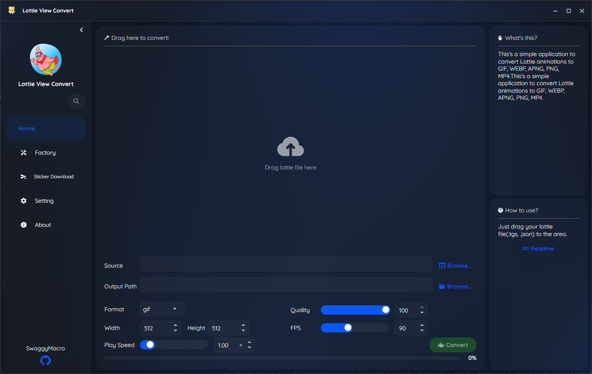

<p align="center">
    
</p>
<p align="center">
    <a href="readme.md"></a>
    
    <a href="//github.com/SwaggyMacro/LottieViewConvert"></a>
</p>
<p align="center">
    
</p>
## 🎬 Lottie & TGS 动画转换器

一个功能强大的跨平台桌面应用程序，用于将 TGS（Telegram 贴纸）和 Lottie 动画转换为多种格式，包括 GIF、WebP、APNG、MP4、MKV、AVIF 和 WebM。

### ✨ 特性
---
- **多格式支持**：转换为 GIF、WebP、APNG、MP4、MKV、AVIF、WebM
- **批量处理**：同时转换多个文件
- **TGS & Lottie 支持**：处理 Telegram 贴纸文件（.tgs）和标准 Lottie 文件（.json、.lottie）
- **Telegram 集成**：直接解析和下载 Telegram 贴纸包
- **自定义输出**：调整播放速度、帧率、分辨率和转换质量
- **跨平台**：支持 Windows、macOS 和 Linux
- **现代化界面**：使用 SukiUI 构建，界面美观且响应迅速
- **依赖项自动安装**：通过自动化安装 gifski 和 FFmpeg 来简化设置 
- **并发任务支持**：以加快批量转换速度
---


### 📝 系统要求
---
安装以下依赖项，并确保它们在您的 PATH 中可用：

#### 必需依赖项
- **[gifski](https://gif.ski)** - 用于高质量 GIF 转换
- **[FFmpeg](https://ffmpeg.org)** - 用于视频格式转换（MP4、MKV、WebM）

#### 安装说明
现在，您可以通过应用程序自动安装，或者手动安装。
只需要运行应用程序，然后转到 `设置` -> `依赖项`，它将自动安装 gifski 和 ffmpeg。
`gifski` 仅支持 x64 平台自动安装，如果您使用的是 ARM64 平台，请手动安装。

`目前仅在 Windows, Ubuntu 上通过测试`，其他平台请自行测试，如果您发现问题，请提交 issue 并暂时使用手动安装。

以下是不同操作系统的手动安装说明：

**Windows：**
```bash
# 通过 Chocolatey 安装
choco install gifski ffmpeg

# 或直接下载：
# gifski: https://gif.ski/
# ffmpeg: https://ffmpeg.org/download.html
```

**macOS：**
```bash
# 通过 Homebrew 安装
brew install gifski ffmpeg
```

**Linux (Ubuntu/Debian)：**
```bash
# gifski
sudo snap install gifski
# 或
cargo install gifski

# ffmpeg
sudo apt update
sudo apt install ffmpeg
```

**验证安装：**
```bash
gifski --version
ffmpeg -version
```

### 🚀 快速开始
---

#### 1. 下载和安装
- 从 [Releases](https://github.com/SwaggyMacro/LottieViewConvert/releases) 页面下载最新版本
- 将压缩包解压到您喜欢的位置
- 运行应用程序可执行文件

#### 2. 基本用法
##### Single Conversion
1. **Launch the application**
2. **Select source files**: Click "Browser" right the Home Page,  or drag & drop TGS/Lottie files
3. **Choose output format**: Select from GIF, WebP, APNG, MP4, MKV, AVIF, WebM
4. **Adjust settings** (optional):
   - Frame rate (1-240 fps, 100 fps for GIF only)
   - Resolution
   - Playback speed (0.1x - 10.0x)
   - Quality settings
5. **Convert**: Click "Convert"

##### Batch Conversion
1. **Launch the application**
2. **Go to the Factory Page**
3. **Browser Tgs/Lottie Folder**: Select a folder containing TGS or Lottie files, or just drag & drop the folder.
4. **Adjust settings like single conversion**
5. **Convert**: Click "Start"

##### Download Telegram Stickers
1. **Launch the application**
2. **Set up the Telegram Bot Token**: Go to `Settings` -> `Telegram`, and enter your bot token.
   - You can get a bot token by creating a bot with [BotFather](https://t.me/botfather) on Telegram.
   - Set up the proxy if needed in `Settings` -> `Proxy`.
3. **Go to the Tgs Download Page**
4. **Enter the sticker set URL**: Paste the Telegram sticker set URL (e.g., `https://t.me/addstickers/Godzi`)
5. **Download**: Click "Download" to fetch all stickers in the set

##### 单个转换
1. **启动应用程序**
2. **选择源文件**：点击主页右侧的“浏览”，或拖放 TGS/Lottie 文件
3. **选择输出格式**：从 GIF、WebP、APNG、MP4、MKV、AVIF、WebM 中选择
4. **调整设置**（可选）：
   - 帧率（1-240 fps，GIF 仅限 100 fps）
   - 分辨率
   - 播放速度（0.1x - 10.0x）
   - 质量设置
5. **转换**：点击“转换”

##### 批量转换
1. **启动应用程序**
2. **转到工厂页面**
3. **浏览 Tgs/Lottie 文件夹**：选择包含 TGS 或 Lottie 文件的文件夹，或直接拖放文件夹。
4. **像单个转换一样调整设置**
5. **转换**：点击“开始”

##### 下载 Telegram 贴纸 (支持普通贴纸包和动画贴纸包)
1. **启动应用程序**
2. **设置 Telegram Bot Token**：转到 `设置` -> `Telegram`，并输入您的机器人令牌。
   - 您可以通过在 Telegram 上使用 [BotFather](https://t.me/botfather) 创建机器人来获取机器人令牌。
   - 如有需要，请在 `设置` -> `代理` 中设置代理。
3. **转到 Tgs 下载页面**
4. **输入贴纸包 URL**：粘贴 Telegram 贴纸包 URL（例如，`https://t.me/addstickers/Godzi`）
5. **下载**：点击“下载”以获取贴纸包中的所有贴纸

   

#### 3. 高级功能
- **质量预设**：自定义质量设置
- **批量操作**：排队处理多个转换任务
- **直接下载 Telegram 贴纸**：使用机器人令牌从 Telegram 下载贴纸包
- **预览**：转换前实时预览动画
- **进度跟踪**：监控每个文件的转换进度

### 🖼️ 界面截图
---


https://github.com/user-attachments/assets/b8afe3d4-2301-4c07-9735-6a5238922f6b

### 📋 支持的格式
---

#### 输入格式
- `.tgs` - Telegram 贴纸文件
- `.json` - Lottie 动画文件

#### 输出格式
- `.gif` - 动画 GIF
- `.webp` - 动画 WebP
- `.apng` - 动画 PNG
- `.mp4` - MP4 视频
- `.mkv` - Matroska 视频
- `.avif` - AV1 图像文件格式
- `.webm` - WebM 视频

### 🔧 从源码构建
---

#### 前置要求
- .NET 8.0 SDK
- Visual Studio 2022 或 JetBrains Rider

#### 构建步骤
```bash
git clone https://github.com/SwaggyMacro/LottieViewConvert.git
cd LottieViewConvert
dotnet restore
dotnet build --configuration Release
dotnet run --project LottieViewConvert
```

#### 特定平台构建
```bash
# Windows
dotnet publish -c Release -r win-x64 --self-contained

# macOS
dotnet publish -c Release -r osx-x64 --self-contained

# Linux
dotnet publish -c Release -r linux-x64 --self-contained
```

### 🛠️ 技术栈
---
- **框架**：C# 配合 Avalonia UI
- **架构**：ReactiveUI 实现 MVVM 模式
- **渲染**：SkiaSharp Skottie 用于 Lottie 动画渲染
- **WebP 处理**：ImageMagick
- **依赖项**：gifski、FFmpeg

### 🤝 贡献
---
欢迎贡献！请随时提交 Pull Request。对于重大更改，请先开启一个 issue 来讨论您想要更改的内容。

1. Fork 仓库
2. 创建您的特性分支 (`git checkout -b feature/AmazingFeature`)
3. 提交您的更改 (`git commit -m 'Add some AmazingFeature'`)
4. 推送到分支 (`git push origin feature/AmazingFeature`)
5. 开启一个 Pull Request

### 📄 许可证
---
本项目基于 MIT 许可证 - 查看 [LICENSE](LICENSE) 文件了解详情。

### 🔗 相关项目
---
- [lottie-converter](https://github.com/ed-asriyan/lottie-converter) - 在网页上渲染 After Effects 动画
- [rlottie](https://github.com/Samsung/rlottie) - 平台无关的独立库
- [gifski](https://github.com/ImageOptim/gifski) - 基于 libimagequant 的 GIF 编码器
- [FFmpeg](https://github.com/FFmpeg/FFmpeg) - 录制、转换和流式传输音视频的完整解决方案
- [SkiaSharp](https://github.com/mono/SkiaSharp) - Skia 的 .NET 绑定

### 🙏 致谢
---
- **Lottie** by Airbnb 提供动画格式
- **Telegram** 提供 TGS 格式
- **gifski** 团队提供优秀的 GIF 编码器
- **FFmpeg** 社区提供视频处理能力
- **Avalonia** 团队提供跨平台 UI 框架

### 📞 支持
---
如果您遇到任何问题或有疑问：
- 📝 [提交问题](https://github.com/SwaggyMacro/LottieViewConvert/issues)
- 💬 [开始讨论](https://github.com/SwaggyMacro/LottieViewConvert/discussions)
- 📧 邮箱：[your-email@example.com]

---
<p align="center">由 <a href="https://github.com/SwaggyMacro">SwaggyMacro</a> 用 ❤️ 制作</p>
